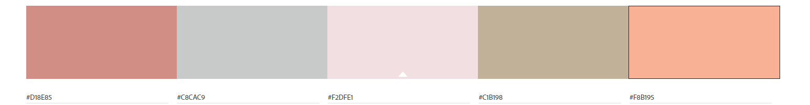
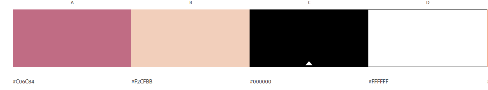

# **NORAH'S CERAMICS WEBSITE**

## **INTRODUCTION**


Norah's Ceramics - an online shop with handmade ceramic and glass products and also zero waste accessories for kitchen and bathroom.

Using the principles of UX design, this fully responsive and interactive website was developed using HTML, CSS, JavaScript and Python, and Django as a framework.

View live project here [link to deployed link](https://norahsceramics.herokuapp.com/)

## **PAYMENT**

To make a test payment, you may use the following card number:

Visa: 4242 4242 4242 4242

## **TABLE OF CONTENT**

- [UX Design](#ux-design)
  - [Strategy](#Strategy)
  - [User stories](#User-stories)
  - [Scope](#Scope)
  - [Structure](#Structure)
  - [Skeleton](#Skeleton)
  - [Design](#Design)
- [Features](#features)
  - [Existing features](#existing-features)
  - [Features left to implement](#features-left-to-implement)
- [Data validation](#data-validation)
- [CRUD operations and defensive design](#crud-operations-and-defensive-design)
  - [CRUD operations](#crud-operations)
  - [Defensive design](#defensive-design)
- [Technologies Used](#technologies-used)
  - [Languages](#languages)
  - [Databases platform and cloud storage](#databases-platform-and-cloud-storage)
  - [Libraries and frameworks](#libraries-and-frameworks)
  - [Other technologies](#other-technologies)
- [Testing](#testing)
  - [Introduction](#introduction)
  - [Code validation](#code-validation)
  - [Testing User stories](#testing-user-stories)
  - [Automated testing](#automated-testing)
  - [Testing accessibility and performance](#testing-accessibility-and-performance)
  - [Interesting issues and known bugs](#interesting-issues-and-known-bugs)
- [Deployment](#deployment)
  - [Deployment on heroku](#deployment-on-heroku)
  - [How to run the code locally](#how-to-run-the-code-locally)
- [Credits](#credits)
  - [Code](#code)
  - [Media and content](#media-and-content)

## **UX DESIGN**

- ### **Strategy**

  More and more people are becoming aware of the pollution of our planet with plastic.
  The purpose of the created online store is to promote items that are handcrafted from environmentally friendly ingredients and to minimize the use of plastic.
  Zero waste accessories are made of recycled products or natural materials.

  - #### **Site owner goal**

    - To increase online presence
    - To promote eco friendly products.
    - To find as many customers as possible.
    - Convert interest into sales.

  - #### **User goals**
    - To access a user-friendly website across multiple devices.
    - To discover eco-friendly products for everyday use.
    - Reduce plastic pollution.
    - Find unusual products.

- ### **User stories**

  1. **As a new user:**

     - As a new user, I want to easily navigate across the site so that I can find the information I need.
     - As a new user, I want to locate social media links to find opinions about the company and check how trusted and known they are.
     - As a new user, I want to find a section describing the company to find out when it was founded and the rest of the pertinent information about this company.
     - As a new user ,I want to easily understand the main purpose of the website.
     - As a new user I want to have option to see passwords so I will not make a mistake typing it.
     - As a new user , I want to view all the products available so that I can quickly have an overview of what is on offer.
     - As a new user, I want to view available products by specific category so that I can quickly find products I’m interested in.
     - As a new user , I want to find a section describing the company to find out when it was founded and the rest of the pertinent information about this company.

  2. **As a frequent user:**

     - As a frequent user, I want to view the product details so that I can make an informed decision.
     - As a frequent user, I want to know what products are new arrivals, so I can be up to date with the new products.
     - As a frequent user, I want to sort the list of products so that I can find a piece within my price range.
     - As a frequent user, I want to review items in my shopping bag so that I can adjust quantities ordered.
     - As a frequent user, I want to see messages after logging in, logging out, or register so I will know what is happening.
     - As a frequent user, I want to be able to create my profile so I can update my personal information.
     - As a frequent user, I want to be able to delete my profile so my personal information is removed from the website.
     - As a frequent user, I want to verify forgotten password so I can log in to my profile.
     - As a frequent user, I want to have the ability to change my password so I can keep my account safe.
     - As a frequent user, I want to know which products are best sellers, so I can make better decision.
     - As a frequent user , I want to enter payment information in a safe and secure way so that I can checkout quickly with confidence.
     - As a frequent user, I want to receive confirmation for my order so that I can have a proof of purchase.
     - As a frequent user, I want to be able to write products review , so I can help others users with choosing the products.
     - As a frequent user, I want to sign up for the Newsletter to email any major updates and/or changes to the website or organization.
     - As a frequent user, I want to be able to contact the platform owner so I can report any problems or ask questions.
     - As a frequent user, I want to log in and logout so that I can access my profile safely.
     - As a frequent user, I want to register for an account so I can make purchase.

- ### **Scope**

  - #### **Functional requirements**

    - To be able to register using email address and secure password.
    - To be able to login and logout.
    - To be able to add/view/edit/delete profile information.
    - To be able to reset password.
    - To be able to subscribe to the newsletter.
    - To be able to change password.
    - To be able to add/view/edit/delete products.
    - To be able to add/view/edit/delete reviews.
    - To be able to create/view/edit/delete shopping bag.
    - To be able to process orders.
    - To be able to process payments.
    - To be able to sort shop items according to a set of criteria.
    - To be able to email notification to users.
    - To be able to store and retrieve images.
    - To be able to contact the site owner.
    - To handle errors: page 404 not found, page 500 Internal Server Error and page 403 access denied, 401 Unauthorized.

  - #### **Non functional requirements**

    - Display product images and information in engaging way.
    - Intuitive navigation and structure.

  - #### **Content requirements**

    - Clear and concise information on how to use the website.
    - Details for the main artist.
    - Forms where user input is required.
    - Engaging text and headings throughout to introduce the website's main sections.
    - Icons for interactive and visual elements.
    - Background images to provide a visually appealing and engaging interface.
    - Image library for products.
    - Details for the products - materials, size, price.

- #### **Business rules**

  - Products may be set as active or inactive.
  - Products can't be deleted and should be set as inactive instead.
  - Products can be added to database and not be available for purchase.
  - Delivery are free and items can only be shipped to a UK address.

- ### **Structure**

  - #### **Organization of functionality and content**

    - Header: Logo and a collapsible menu with navigational links.
    - Homepage: Give an overview of the website purpose, including hero images and text, three links for three product categories, and a link for 'shop all', which leads to all products.
    - Best Sellers: Displays six best-selling products.
    - New collection: Information about new ceramic decor collection with link which leads to list of this products.
    - Why us?: Information on the benefits of purchases in store.
    - Our values: Information about store values.
    - About: Information about the owner and company.
    - Contact: The form allows users to send an inquiry to the website owner.
    - Product page: Display product details.
    - Register: This contains the form for registering an account.
    - Login: This contains the form for logging in to the account.
    - Shopping bag: Display items added in the bag.
    - Newsletter: Form for subscribing to the newsletter.
    - My profile - Personal Information: Contain forms for update personal and address information, link to change password and link to delete account.
    - My profile - Orders: Contain information about user orders history.
    - My profile - Reviews: Contain information about user reviews history.
    - Footer: Links to social media, policies and contact information.

  - #### **Interaction design**

    - Collapsible menu.
    - Buttons, icons and links with hovering effect.
    - Pop up modal forms.

  - #### **Database structure**

    The diagram below illustrates the database structure used in this project, first managed using SQLite during the development process, then Postgres in production with Heroku.

    

    - **User**

      - The Django default User model is replaced by the custom AbstractUser because:
        - During authentication, the application uses an email address to identify uniquely.
      - Stores users' registration information provided upon signing up.

    - **AddressDetails model**

      - Stores site users' detailed address information.
      - Address using a one-to-one relationship with the user model.
      - This model is used to generate an address form in the user profile.

    - **Productrreview model**

      - Stores review details about the product such as stars rating and review description.
      - Related to the product model and user model.

    - **Product model**

      - Stores detailed information about a product to be displayed in product detail page.
      - Related to the subcategory and color model.

    - **Category model**

      - Stores product categories.
      - Related to the subcategory model.

    - **Subcategory model**

      - Stores product subcategories.
      - Related to the category model.

    - **Color model**

      - Stores product colors.

    - **Newsletteruser model**

      - Stores users subscribed to the newsletter.
      - Connected via webhook with "Mailchimp" service.
      - If the user resigns from receiving the newsletter, "Mailchimp" creates a request to the webhook, and the endpoint changes subscription status in the database.

    - **Basket model**

      - Contains all logic related to basket operations: add product, subtract product, delete product, total basket price, total basket products qty, basket summary.
      - Related to the user model.

    - **Basketproduct model**

      - Stores basket products.
      - Related to the basket model and product model.

    - **Order model**

      - Contains all information about order.
      - Related to the user model.

    - **Orderproduct model**

      - Stores ordered products.
      - Related to the order model and product model.

- ### **Skeleton**

  - ### **Wireframes**

    - All projects was created in Adobe XD:

    - [Home page](/documents/home-page-project.png)
    - [Login, register page](/documents/login-register-project.png)
    - [About](/documents/about-page-project.png)
    - [Product list](/documents/product-list-project.png)
    - [Product details](/documents/product-detail-project.png)
    - [Basket](/documents/basket-project.png)

- ### **Surface / Design**

  The website feature a simple, modern and engaging design, with bright colors to arouse positive emotions among users.
  All parts of this website are custom made from the scratch.

  - #### **Imagery**

    - Hero image is designed to catch the user's attention. It also has a modern, energetic aesthetic.
    - The photos in the all sections are very positive and are meant to inspire the trust of the users.

  - #### **Colour scheme**

    The website will use the following color palette:

    
    

  - #### **Typography**

    The website will use the following fonts from Google:

    - [Nanum Pen Script](https://fonts.google.com/specimen/Nanum+Pen+Script?query=Nanum+Pen+Script) for headings.
    - [Hubballi](https://fonts.google.com/specimen/Hubballi?query=Hubballi) for the rest text.

  - #### **Icons**

    Icons by font-awesome used throughout the website to allow users to quickly access functionalities.

  - #### **Styling**
    - Horizontal lines to structure and make the website's content easy to read.
    - Rounded edge borders and buttons for a more user-friendly and inviting interface.
    - Some light shadows to add further dimension and depth to the website.
    - Custom created forms.

## **FEATURES**

- ### **Existing features**

  Implemented features can be found [here](documents/features/features.md).

- ### **Features left to implement**
  - List of favorites products.
  - Complete automated testing in 100%.
  - Ability to share products on social media.
  - Allauth integration with social media platform.

## **DATA VALIDATION**

- #### **Upload product photo**

  - image: required, size validation: max size is 0.4MB.

- #### **Contact form**

  - First and last name: required, max_length: 100, custom Regex validator which allows only letters and spaces,
    (also special French, German, Polish, Italian, Spanish, Swedish, Norvegian,
    Danish, Russian, Ukrainian, Serbian, Bulgarian, Belarusian letters).
  - Email: required, max length: 254, validate with built-in validator from Django.
  - Message: required, max length: 1500.

## **CRUD operations and defensive design**

- ### **CRUD operations**

  | Operations                       | all users | auth. user | superuser |
  | -------------------------------- | --------- | ---------- | --------- |
  | View homepage                    | Yes       | Yes        | Yes       |
  | View about page                  | Yes       | Yes        | Yes       |
  | View contact page                | Yes       | Yes        | Yes       |
  | View newsletter page             | Yes       | Yes        | Yes       |
  | Add/edit/delete profile          | No        | Yes        | Yes       |
  | Add/edit/delete a products       | No        | No         | Yes       |
  | View product details             | Yes       | Yes        | Yes       |
  | Add/edit/delete product category | No        | No         | Yes       |
  | Login                            | No        | Yes        | Yes       |
  | Register                         | Yes       | No         | No        |
  | Edit/delete reviews No           | No        | Yes        |
  | View all reviews                 | No        | Yes        | Yes       |
  | Add/edit/delete a review         | No        | No         | Yes       |
  | View order history and details   | No        | Yes        | Yes       |
  | View shopping basket             | Yes       | Yes        | Yes       |
  | Checkout page                    | Yes       | Yes        | Yes       |

- ### **Defensive design**

  - #### **Delete operations**

    - Users first need to confirm that they are sure that they want to delete user profile.

  - #### **Review status**

    - Reviews can be written only by register users.
    - If the admin does not approve the review:
      - Review will not be displayed on product detail page.
      - In the reviews section in the review box will display information:
        - 'waiting for approval by admin.'
    - If the admin approves the review:
      - In the 'my reviews' section in the review box will display information:
        - 'approved and visible.'
          

  - #### **Status information**
    - If any of the fields are left blank, informative texts appear in their place or toast message on the top of the site.
    - The short texts describe what is missing in a given place.

## **TECHNOLOGIES USED**

- ### **Languages**

  - [HTML](https://html.spec.whatwg.org/multipage/)
  - [CSS](https://www.w3.org/Style/CSS/Overview.en.html)
  - [Javascript](https://developer.mozilla.org/en-US/docs/Web/JavaScript)
  - [Python](https://www.python.org/)

- ### **Databases platform and cloud storage**

  - [SQlite](https://www.sqlite.org/index.html): SQL database engine provided by default as part of Django and used during development.
  - [Heroku Postgres](https://devcenter.heroku.com/articles/heroku-postgresql): SQL database service provided directly by Heroku for storing data.
  - [Cloudinary](https://cloudinary.com/): to store images and static files in production.
  - [Heroku](https://www.heroku.com/): to deploy and run the application in production.

- ### **Libraries and frameworks**

  - [Django](https://www.djangoproject.com/): Python web framework for rapid development and clean, pragmatic design.
  - [Django Phonenumber Field](https://pypi.org/project/django-phonenumber-field/0.2a3/): uk phone numbers validation.
  - [Pillow](https://pillow.readthedocs.io/en/stable/): This library provides extensive file format support, an efficient internal representation, and fairly powerful image processing capabilities.
  - [Jquery](https://jquery.com/): to DOM manipulation and event handling.
  - [Django Allauth](https://django-allauth.readthedocs.io/en/latest/index.html): using for registration, and social account authentication.
  - [Django cleanup](https://pypi.org/project/django-cleanup/): to automatically delete images / files when an ImagField is removed / updated or deleted.
  - [Flake8](https://pypi.org/project/flake8-django/): A plugin to detect bad practices on Django projects.
  - [Black](https://pypi.org/project/black/): for the uncompromising Python code formatter.

- ### **Other technologies**

  - [Google fonts](https://fonts.google.com/): used for body and headings font.
  - [Font Awesome](https://fontawesome.com/): used for icons throughout the website.
  - [Mailchimp](https://mailchimp.com/): Marketing platform used for newsletter.
  - [Stripe](https://stripe.com/gb): Payment.
  - [Termly](https://termly.io/): Policies.
  - [Dbdiagram.io](https://dbdiagram.io/home): to design schema of relational database.
  - [W3C Markup Validation Service](https://validator.w3.org/): to check there's not error in HTML.
  - [W3C CSS Validator](https://jigsaw.w3.org/css-validator/): This tool was used to check there's no error in the CSS code.
  - [PEP8 online](http://pep8online.com/): to validate python syntax.
  - [JSHint](https://jshint.com/): to validate jquery/javascript syntax.
  - [Chrome DevTools](https://developer.chrome.com/docs/devtools/): Google inspect was used to test and fix code and page responsiveness.
  - [Google lighthouse](https://developers.google.com/web/tools/lighthouse): Google lighthouse was used to assess performance of the site.
  - [Doogal](https://www.doogal.co.uk/RandomAddresses.php): random UK addresses generator.
  - [Visual Studio Code](https://code.visualstudio.com/): was used to create and store code.
  - [GitHub](https://github.com/): used to store the code of the project.
  - [Adobe XD](https://www.adobe.com/products/xd/pricing/free-trial.html): for website projects.
  - [Compress](https://compressgif.com/): for compress images.
  - [Realfavicongenerator](https://realfavicongenerator.net/): for favicon.
  - [TablePlus](https://tableplus.com/): for database management.
  - [TempMail](https://temp-mail.org/en/): generates temporary emails, used for registering an account.
  - [Pytest](https://pytest-django.readthedocs.io/en/latest/index.html): for automated tests.

## **TESTING**

- ### **Testing User Stories**

  - Testing User Stories can be found [here](/documents/features/test_user_stories.md).

- ### **Automated testing**

  - Developer implemented 23 automated tests.
  - To check tests run 'pytest' in the terminal.

  - ### **Testing accessibility and performance**

  - Testing through Lighthouse in Chrome extension:

    - For desktop:

    | Section     | Performance | Accessibility | Best Practices | SEO |
    | ----------- | ----------- | ------------- | -------------- | --- |
    | Home        | 95          | 92            | 92             | 90  |
    | About       | 97          | 97            | 100            | 90  |
    | Contact     | 93          | 98            | 100            | 90  |
    | Register    | 91          | 98            | 100            | 90  |
    | Log In      | 93          | 98            | 100            | 90  |
    | Error pages | 95          | 100           | 100            | 90  |

    - For mobiles:

    | Section     | Performance | Accessibility | Best Practices | SEO |
    | ----------- | ----------- | ------------- | -------------- | --- |
    | Home        | 84          | 92            | 100            | 92  |
    | About       | 81          | 100           | 100            | 92  |
    | Contact     | 85          | 100           | 100            | 92  |
    | Register    | 83          | 98            | 100            | 92  |
    | Log In      | 80          | 98            | 100            | 92  |
    | Error pages | 76          | 100           | 100            | 92  |

  - ### **Interesting issues and known bugs**

    - A KNOWN BUGS:

      - Active class doesn't apply correct for 'NEW IN' and 'BEST SELLERS' links in the navbar.

- ### **Code validation**

  - #### **W3C HTML Code Validator**

    Each page for the website was run through the [W3C Markup Validation Service](https://validator.w3.org/) and returned no errors.
    As all web pages are rendered dynamically using the Django template, each page and scenario had to be validated by direct input by copying and pasting the source code for the page.

  - #### **W3C CSS Jigsaw Validator**

    Each CSS file was tested with [W3C CSS Validator](https://jigsaw.w3.org/css-validator/) via direct input and returned no errors

  - #### **JSHint validator**

    All JavaScripts files were tested with [JSHint](https://jshint.com/) and returned no errors.

  - #### **Python 8**

    Each python file was run through [PEP8 online](http://pep8online.com/) and returned no errors.

  - ### **Responsiveness and compatibility**

    The website was tested on Google Chrome, Mozilla Firefox, Opera and Safari browsers.
    The Safari browser doesn't support the 'smooth' behavior parameter in the window.scroll() method.
    The website was viewed on a variety of devices such as Desktop, Laptop (Macbook Pro 16 inch), Mobiles( Huawei P20 Mate, Huawei P30, Samsung S21 ultra).
    A large amount of testing was done to ensure that all pages were linking correctly.
    Friends and family members were asked to review the site and documentation to identify bugs and user experience issues.

## **DEPLOYMENT**

- ### **Deployment on Heroku**

  - This project is deployed on Heroku for production, with all static and media files stored on Cloudinary. These are steps to deploy on Heroku:

  - Navigate to Heroku.com, create a new account or login if you already have an account. On the dashboard page, click "Create New App" button. Give the app a name. Set the region closest to you, and click "Create App".
  - On the resources tab, provision a new Heroku Postgres database.
  - Configure variables on Heroku by navigating to Settings, and click on Reveal Config Vars. You may not have all the values yet. Add the others as you progress through the steps.  
     Varables | Key |
    ---| ---  
     CLOUDINARY_URL | generated in Cloudinary account  
     DATABASE_URL | your database url  
     EMAIL | your email used for SMTP configuration  
     EMAIL_PASSWORD | your email password used for SMTP configuration  
     ENV | PRODUCTION
     MAILCHIMP_API_KEY | generated in Mailchimp account  
     MAILCHIMP_DATA_CENTER | generated in Mailchimp account  
     MAILCHIMP_EMAIL_LIST_ID | generated in Mailchimp account
     SECRET_KEY | your secret key
     STRIPE_PUBLISHABLE_KEY | generated in Stripe account
     STRIPE_SECRET_KEY | generated in Stripe account

  - install dj_database_url and psycopg2.

  ```
  pip3 install dj_database_url
  pip3 install psycopg2-binary
  ```

  - Set up a new database for the site by going to the project's settings.py and importing dj_database_url. Comment out the database's default configuration, and replace the default database with a call to dj_database_url. parse and pass it the database URL from Heroku (you can get it from your config variables in your app setting tab)

  ```
  DATABASES = {
    'default': dj_database_url.parse('YOUR_DATABASE_URL_FROM_HEROKU')
  }
  ```

  - Run migrations

  ```
  python3 manage.py migrate
  ```

  - Set up a new superuser, fill out the username, email address, and password.

  ```
  python3 manage.py create superuser
  ```

  - Remove the database config from Heroku and uncomment the original config. Add a conditional statement to define that when the app is running on Heroku. we connect to Postgres, and otherwise, we connect to Sqlite.

  ```
  if os.getenv("ENV") == "PRODUCTION":
    DATABASES = {
        "default": dj_database_url.parse(os.environ.get("DATABASE_URL"))
    }
  else:
      DATABASES = {
          "default": {
              "ENGINE": "django.db.backends.sqlite3",
              "NAME": BASE_DIR / "db.sqlite3",
          }
      }
  ```

  - Install gunicorn (if you haven't) which will act as the webserver, and put it on the requirements.txt.

  ```
  pip3 install gunicorn
  pip3 freeze > requirements.txt
  ```

  Note: you don't have to do this if you've installed all dependencies in the requirements.txt file.

  - Create a Procfile, to tell Heroku to create a web dyno, which will run unicorn and serve the Django app.

  Inside the Procfile:

  ```
  release: python manage.py migrate
  web: gunicorn norahs_ceramics.wsgi
  ```

  - Login to Heroku through CLI, using `heroku login`. Once logged in, disable the collect static temporarily, so that Heroku won't try to collect static files when it deploys.

  ```
  heroku config:set DISABLE_COLLECTSTATIC=1 --app norahs_ceramics
  ```

  And add the hostname of the Heroku app to allowed hosts in the project's settings.py, and also add localhost so that Gitpod will still work as well:

  ```
  ALLOWED_HOSTS = ["norahsceramics.herokuapp.com/", "localhost", "127.0.0.1"]
  ```

  - Add, commit, and push to Github and then to Heroku. After pushing to Github as usual, initialize git remote first:

  ```
  heroku git:remote -a norahs_ceramics
  ```

  Then push to Heroku:

  ```
  git push heroku main
  ```

  - Go to the app's dashboard on Heroku and go to Deploy. Connect the app to Github by clicking Github and search for the repository. Click connect. Also enable the automatic deploy by clicking Enable Automatic Deploys, so that everytime we push to github, the code will automatically be deployed to Heroku as well.
  - Go back to settings.py and replace the secret key setting with the call to get it from the environment, and use empty string as a default.

  ```
  SECRET_KEY = os.environ.get('SECRET_KEY', '')
  ```

  Set debug to be true only if there's a variable called development in the environment.

  ```
  if os.getenv("ENV") == "PRODUCTION":
    DEBUG = False
    X_FRAME_OPTIONS = "SAMEORIGIN"
  else:
    DEBUG = True
  ```

- ### **How to run the code locally**

  - ### **Forking the GitHub Repository**

  By forking the GitHub Repository we make a copy of the original repository on our GitHub account to view and/or make changes without affecting the original repository by using the following steps...

  1. Log in to GitHub and locate the [GitHub Repository](https://github.com/Izabela88/norahs-ceramics)
  2. At the top of the Repository (not top of page), just above the "Settings" button on the menu, locate the "Fork" button.
  3. You should now have a copy of the original repository in your GitHub account.

  - ### **Making a Local Clone**

  1. Log in to GitHub and locate the [GitHub Repository](https://github.com/Izabela88/norahs-ceramics)
  2. Under the repository name, click "Clone or download".
  3. To clone the repository using HTTPS, under "Clone with HTTPS", copy the link.
  4. Open Git Bash
  5. Change the current working directory to the location where you want the cloned directory to be made.
  6. Type `git clone`, and then paste the URL you copied in Step 3.

  ```
  $ git clone https://github.com/YOUR-USERNAME/YOUR-REPOSITORY
  ```

  7. Press Enter. Your local clone will be created.

  ```
  $ git clone https://github.com/YOUR-USERNAME/YOUR-REPOSITORY
  > Cloning into `CI-Clone`...
  > remote: Counting objects: 10, done.
  > remote: Compressing objects: 100% (8/8), done.
  > remove: Total 10 (delta 1), reused 10 (delta 1)
  > Unpacking objects: 100% (10/10), done.
  ```

  Click [Here](https://help.github.com/en/github/creating-cloning-and-archiving-repositories/cloning-a-repository#cloning-a-repository-to-github-desktop) to retrieve pictures for some of the buttons and more detailed explanations of the above process.

## **CREDITS**

- ### **Code**

  - While coding for some problems and inspirations with JavaScript code, I looked for answers on websites:

  - [W3School](https://www.w3schools.com/)
  - [Stack Overflow](https://stackoverflow.com/)
  - [JavaScript Tutorial](https://www.javascripttutorial.net/)
  - [MDN Web Docs](https://developer.mozilla.org/en-US/)

- ### **Media and content**

  - Text and products photos was taken from [wearth](https://www.wearthlondon.com/) website.

  - [Unsplash](https://unsplash.com/): for images
  - [Lottiefiles](https://lottiefiles.com/): for used animations
  - [Pixlr](https://pixlr.com/pl/): was used to process used photos
  - [CSS Scan](https://getcssscan.com/css-box-shadow-examples): for box shadow example
  - [Free Frontend](https://freefrontend.com/): for CSS and JavaScript inspirations
  - [Crello](https://create.vista.com/pl/home/): for create the logo
  - [Mdigi](https://mdigi.tools/): for create gradients
  - [Freepik](https://www.freepik.com/): for images
